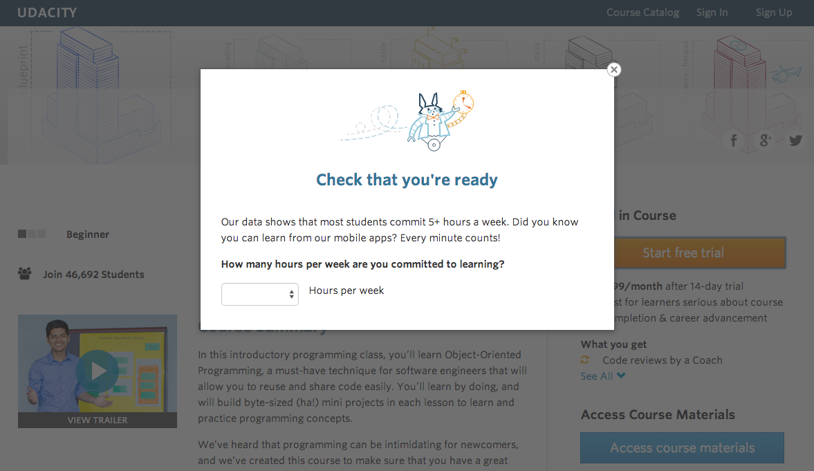
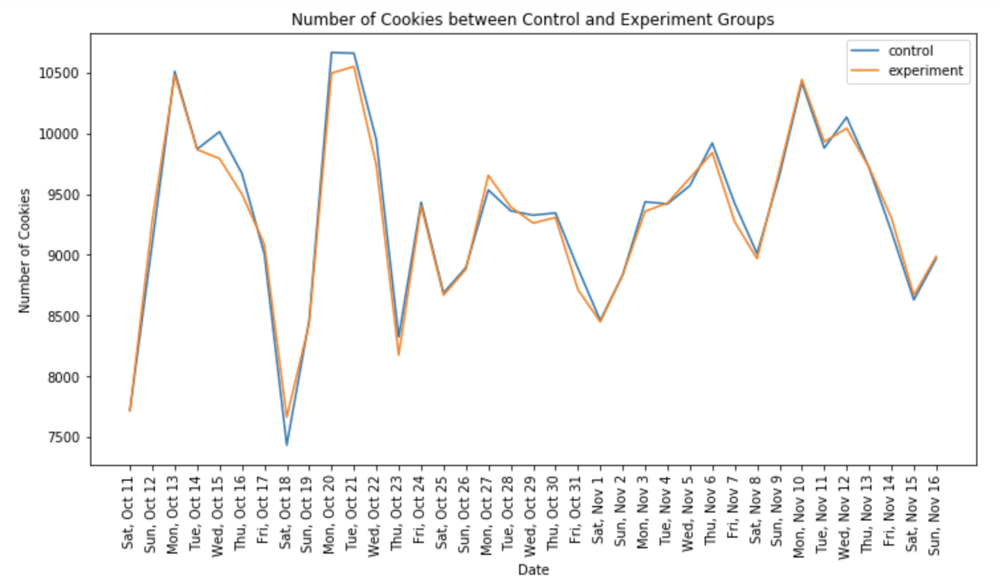
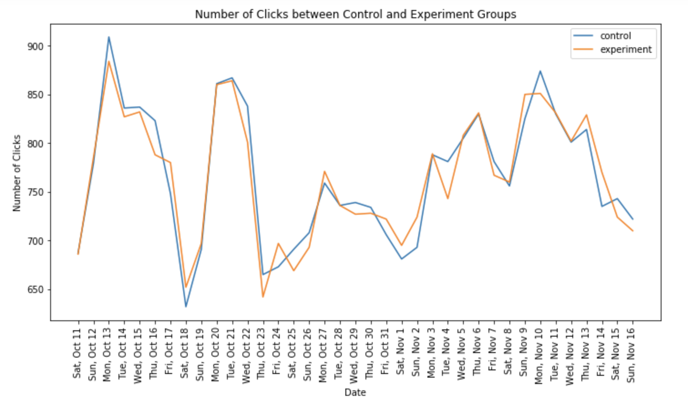
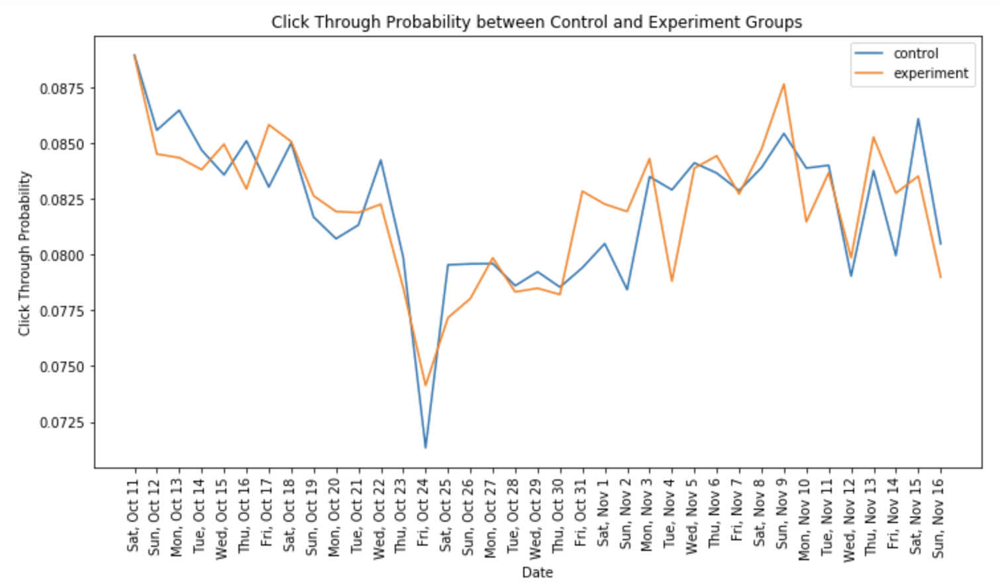
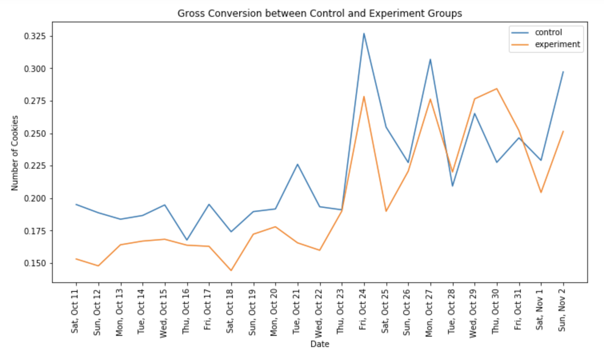
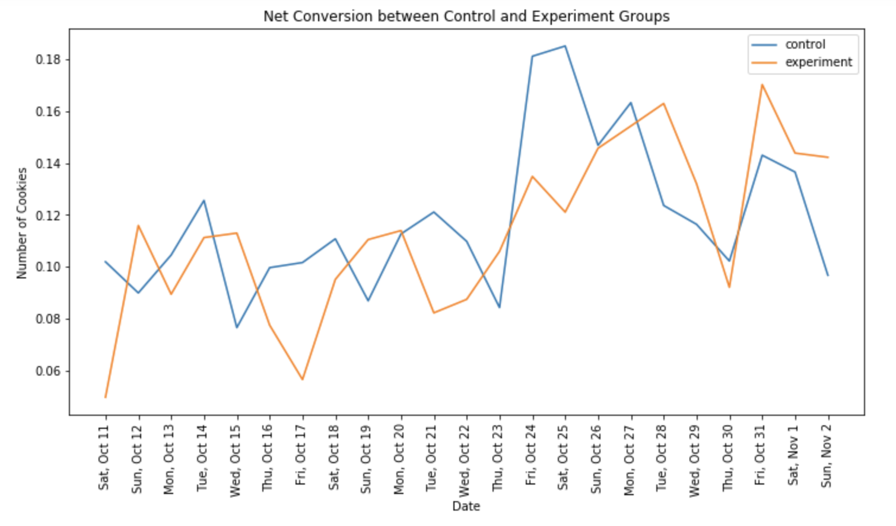
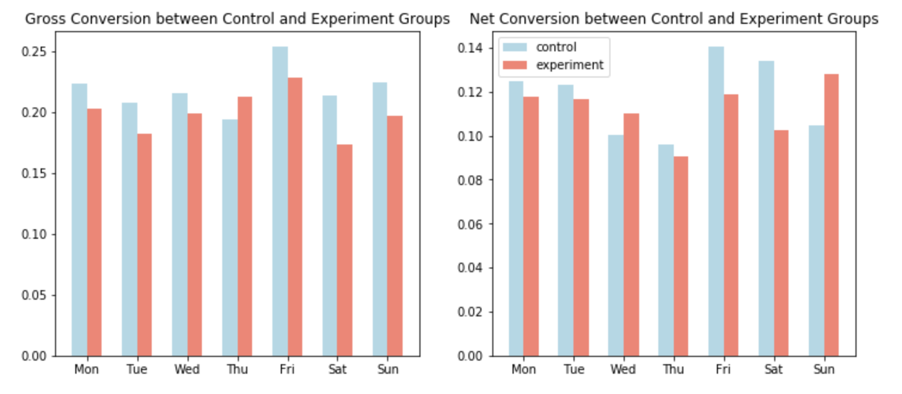

# Data-Driven-Website-Optimization-for-Increased-Conversions - AB-Testing-Project
## At-a-glance
Imagine you're on Udacity's website, looking at a course. Currently, you have two options: dive right in with a free trial that requires your credit card, or explore the course content for free without extra perks.

A change was tested. When you clicked "start free trial," you were asked how much time you could dedicate to the course each week.

If you said 5 hours or more, everything worked like normal. But if you said less than 5 hours, a message suggested that Udacity courses usually need a bigger time commitment. Then, you were given another option: keep the free trial, or switch to exploring the course for free.

The goal was to see if this extra step helped students pick the right path and if it affected how many people signed up for the free trial.

## Free Trial Optimization Test 

Udacity currently offers two primary options for course engagement: an immediate free trial requiring credit card information and a free access model providing limited course content. To enhance user experience and optimize conversion rates, an experiment was conducted to qualify potential free trial enrollees based on their estimated time commitment.

A new flow was introduced where users clicking "Start Free Trial" were prompted to indicate their weekly study hours. Those allocating five or more hours per week proceeded to the standard checkout process. Conversely, users with a lower time commitment were presented with a message highlighting the typical time investment required for course completion and offered the alternative of accessing course materials without enrollment.

## 1. Experiment Design
### 1.1 Unit of Diversion (provided by Udacity)
The unit of diversion is a **cookie**, although if the student enrolls in the free trial, they are tracked by user-id from that point forward. The same user-id cannot enroll in the free trial twice. For users that do not enroll, their user-id is not tracked in the experiment, even if they were signed in when they visited the course overview page.

### 1.2 Initial Hypothesis 
The hypothesis was that this might set clearer expectations for students upfront, thus **reducing the number of frustrated students who left the free trial** because they didn't have enough time—without significantly reducing the number of students to continue past the free trial and eventually complete the course. If this hypothesis held true, Udacity could improve the overall student experience and improve coaches' capacity to support students who are likely to complete the course. (Provided by Udacity)  
  
Based on the information above, we can set some initial hypotheis: (these are just initial hypothesis and we will revise them further)

  1. H0: the change has no effect on the number of students who enroll the free trial.  
     H1: the change reduces the number of students who enroll the free trial.
   
   
  2. H0: the change has no effect on the number of students who leave the free trial.  
     H1: the change reduces the number of students who leave the free trial.  
    
    
  3. H0: the change has no effect on the probability of students who continue the free trial after 14 days.  
     H1: the change increases the probability of students who continue the free trial after 14 days.  
     (since we cannot say the number will be increased or decreased here, we use probability.)
     
### 1.3 Metric Choice
there are seven choices from Udacity below.

- **Number of cookies**: That is, number of unique cookies to view the course overview page. (dmin=3000)
- **Number of user-ids**: That is, number of users who enroll in the free trial. (dmin=50)
- **Number of clicks**: That is, number of unique cookies to click the "Start free trial" button (which happens before the free trial screener is trigger). (dmin=240)
- **Click-through-probability**: That is, number of unique cookies to click the "Start free trial" button divided by number of unique cookies to view the course overview page. (dmin=0.01)
- **Gross conversion**: That is, number of user-ids to complete checkout and enroll in the free trial divided by number of unique cookies to click the "Start free trial" button. (dmin= 0.01)
- **Retention**: That is, number of user-ids to remain enrolled past the 14-day boundary (and thus make at least one payment) divided by number of user-ids to complete checkout. (dmin=0.01)
- **Net conversion**: That is, number of user-ids to remain enrolled past the 14-day boundary (and thus make at least one payment) divided by the number of unique cookies to click the "Start free trial" button. (dmin= 0.0075)  

dmin means the practical significance boundary for each metric, that is, the difference that would have to be observed before that was a meaningful change for the business, is given in parentheses. All practical significance boundaries are given as absolute changes.

#### 1.3.1 Choosing Invariant Metrics
The invariant metrics (control variables) are metrics that we expect not to change between experiment and control group. And they will be used for sanity check

Based on the metrics above, we would like to treat these three as invariant metrics: 
- **Number of cookies**
- **Number of clicks**
- **Click-through-probability**: Number of clicks / Number of cookies

Because these are the data that we can collect before the change, so they must nearly be same in both test and control group. And these three are all dependent on cookies, which is the unit of diversion for this project.  
Also, for the click through probability, though it covers both number of cookies and number of clicks, it might be unexpected vary during sanity check, so it is much safer to track those three.

#### 1.3.2 Choosing Evaluation Metrics
For evaluation indicators, we should not only care the statistical significance, but also whether the change of the metric is significant in practice (dmin), because the treatment may not be worth implementing (although there is statistical significance).  
    

We consider these three metrics below can be used for our A/B testing project.
- **Gross conversion**: we expect this metric will be decreased in treatment group. (users get the question and will have a second to consider enroll or not, this will filter some users who are not willing to checkout after free trial period).  

- **Retention**: we expect this metric will be increased in treatment group. (since the question has already filtered some uses who are not willing to checkout after free trial period, the retention rate should get higher).  

- **Net conversion**: since it is the product of the two above, we cannot expect its direction, which may vary.   
  
  
  
- **Attention:** 
  **Number of user-ids**: for this metric, we won't use it because:
    - User-ids are tracked only after enrolling in the free trial, so we cannot expect the equal distribution between the control and experimental group. It isn't normalized.
    - Also, the information about number of user-ids can be inculded in the gross conversion. 

#### 1.3.3 Hypothesis Revised
Based on the metrics we choose and the initial hypothesis, we can revise our hypothesis.

 1. H0: Gross Conversion(control) = Gross Conversion(treatment)  
    H1: Gross Conversion(control) != Gross Conversion(treatment)
 2. H0: Retention(control) = Retention(treatment)  
    H1: Retention(control) != Retention(treatment)
 3. H0: Net Conversion(control) = Net Conversion(treatment)  
    H1: Net Conversion(control) != Net Conversion(treatment)
    
## 2. Measuring Standard Deviation  

In binomial distribution, the standard deviation = sqrt(p(1-p)/n)

**Standard Deviation for Evaluation Metrics**
| Evaluation Metrics	      | Standard Deviation     | 
| ---------- | :-----------:  | 
| Gross Conversion	     | 0.0202    | 
| Retention     | 0.0549    | 
| Net Conversion     | 0.0156     | 

## 3. Sizing
We set the alpha to be 0.05 and the statistical power to be 0.80 (i.e. beta is 0.20).
And we used an online calculator and the results are as follows.

**Sizing for Each Evaluation Metrics**
| Evaluation Metrics	      | Sample Size     | 
| ---------- | :-----------:  | 
| Gross Conversion	     | 645,875    | 
| Retention     | 4,741,212    | 
| Net Conversion     | 685,325     | 

Given the calculation above, to test these three hypothesis, we need 4,741,212 pageviews.

### 3.0.1 multiple hypothesis?
As we now have three hypothesis, and these three hypothesis are not fully independent. So the false positive rate is likely to be increased. We can solve the multiple hypothesis problem by Bonferroni Correction method, but it still has backward that it will increase the fale negatives. Therefore, we prefer not to solving this problem.

## 3.1 Choosing Duration vs. Exposure
From the Udacity, given there are 40k pageviews per day, we can first assume we can use 100% of users for this experiment.
However, we've calculated that: 
- for the experiment with gross conversion, retention and net conversion, we need:  119  days
- for the experiment with gross conversion and net conversion, we need:  17  days

We can see there is a huge difference in experiment duration between using and discarding retention. Therefore, we decide to remove the retention metric for this experiment. Because firstly, using the retention metric will take a long time to conduct this experiment, which will cause opportunity costs(eg. launch more different experiments, spend more time on other feature improvements). Moreover, there will be some business risks that exist if we use the retention metric. For instance, this change will give a worse user experiment decreasing the conversion rate.

Also, for the experiment with gross conversion and net conversion, we should reconsider the fraction of Udacity's traffic to be diverted. Considering there might be some seasonal effect for this experiment, 17 days seems not enough for us to certain. Secondly, using full traffic is very costly and risky (opportunity cost & business risk we mentioned above). Diverting a half or lower of traffic will be much safer.

- for the experiment using 50% traffic with gross conversion and net conversion, we need:  34  days
- for the experiment using 45% traffic with gross conversion and net conversion, we need:  38  days

It seems that 38 days are little bit longer, so we will divert 50% traffic for the experiment with gross conversion and net conversion.

## 4. Experiment Analysis
Now, we have two datasets from Udacity, one for control group and one for experiment group.

The meaning of each column is:

- Pageviews: Number of unique cookies to view the course overview page that day.
- Clicks: Number of unique cookies to click the course overview page that day.
- Enrollments: Number of user-ids to enroll in the free trial that day.
- Payments: Number of user-ids who who enrolled on that day to remain enrolled for 14 days and thus make a payment. (Note that the date for this column is the start date, that is, the date of enrollment, rather than the date of the payment. The payment happened 14 days later. Because of this, the enrollments and payments are tracked for 14 fewer days than the other columns.)

### 4.1 Sanity Check
#### 4.1.1 visualization
We can make some visualizations to make a clear comparison between control and experiment groups on invariant metrics.

Here we also found there is a dramatically drop on click through rate on Oct. 24th. It's worthwhile to find the potential reason and effects.

#### 4.1.2 sanity checks

First, we've already calculated the size of control group and experiment group:

control group size: 345543
experiment size: 344660
sample size: 690203
Is the difference between the size of control group and experiment group within our expectations?

**cookies and clicks**
Given each cookie is randomly assgined to the control or experiment group with probability 0.5. If we now regard being assigned to the control group as a success, we can use the binominal distribution to model the number of successes in the given whole sample (control+experiment) and perform a binomial test as sanity check. (We further assume the whole sample size are large enough to approach the normal distribution (Central Limit Theorem)). (And for the Clicks metric, we can also use the binomial test.)

**click through probability**
For the click through probability, we've already assumed the sample performs the normal distribution. Therefore, we can further assume that the click through probability in both control and experiment groups perform the binomial distribution. So we can lauch a Z-test to check the click through probability. (pooled p)

| Invariant Metrics	      | CI_lower	     | CI_upper		     | Observed Value	     | Result	     | 
| ---------- | :-----------:  |:-----------:  | :-----------:  | :-----------:  |  
| Cookies	     | 0.4988    | 0.5012    | 0.5006    | Pass    |
| Clicks     | 0.4959	    | 0.5042    | 0.5005    | Pass    | 
| CTP     | 0.0812     | 0.0830    | 0.0822    | Pass    | 

Based on the Sanity Check chart, we can conclude that all invariant metrics have stood the test successfully.

### 4.2 Result Analysis
#### 4.2.1 visualization
We can make some visualizations to make a clear comparison between control and experiment groups on evaluation metrics.

We can also see there is a huge peak on Oct.24th. According to we've mentioned a drop of click through probability on Oct.24th, we can infer that there is a larger number of pageviews. We recommend Udacity teams to do some further analysis on the whole traffic instead of this sample size.

#### 4.2.2 Check for Practical and Statistical Significance  
Now, both gross conversion and net conversion are probabilities, similar to click-through probability. Therefore, we can check them as we checked the click-through rate above. However, this time we will check for both practical(dmin) and statistical significance. 
**Notice:** Because the payments and enrollments are None in the last 14 days, we should recalculate the real sample size for checking the evaluation metrics.

| Evaluation Metrics	      | CI_lower	     | CI_upper		     | Observed Value	     | Statistic Result	     | dmin	     | Practical Result
| ---------- | :-----------:  |:-----------:  | :-----------:  | :-----------:  | :-----------:  | :-----------:  | 
| Gross Conversion	     | -0.0291   | -0.0120	    | -0.0205   | Pass    | -0.01    | Pass    |
| Net Conversion     | -0.0116	    | 0.5042    | 0.0019	    | Fail    | 0.0075	   | Fail    | 

Now we can see the gross conversion decreased 2% in this A/B test, which was statiscally and practically significant while the net conversion was not.

#### 4.2.3 Week Analysis
At last, we were asked to finish the sign test for this A/B test. However, the prior assumption for sigh test that the two dependent samples should be paired or matched viloates our A/B test assumption. So we will forgo this additional test, instead, we can make an analysis about the seasonality.

| Day	      | GC_control	     | GC_experiment		     | diff_GC	     | NC_control	     | NC_experiment	     | diff_NC    
| ---------- | :-----------:  |:-----------:  | :-----------:  | :-----------:  | :-----------:  | :-----------:  | 
| Mon	     | 0.2234|	0.2032|	-0.0203	|0.1250	|0.1177	|-0.0073|
|Tue	|0.2075	|0.1825|	-0.0249|	0.1234|	0.1166|	-0.0068|
|Wed	|0.2158	|0.1987	|-0.0170|	0.1002	|0.1102|	0.0099|
|Thu	|0.1944	|0.2122	|0.0178	|0.0959 |0.0908	|-0.0050|
|Fri	|0.2539	|0.2287	|-0.0251|	0.1406	|0.1187	|-0.0219|
|Sat	|0.2140	|0.1732	|-0.0408|	0.1342	|0.1025	|-0.0316|
|Sun	|0.2247	|0.1970	|-0.0277|	0.1048	|0.1283|	0.0235|

From charts above, we can see this experiment are less effective for gross conversion on Thursday, with regards to the net conversion, Wednesday and Sunday are not effective. We can also see this experiment for net conversion are more fluctuated in a week.

### 4.3  Results Interpretation & Recommendations

#### Summary of Findings

The A/B test aimed to assess the impact of a new free trial screener on key metrics: Gross Conversion and Net Conversion. The experiment was conducted over 34 days with 50% of traffic diverted to the treatment group.

1. Gross Conversion: The introduction of the free trial screener led to a statistically significant and practically significant decrease in Gross Conversion. This implies that the screener effectively filtered out a portion of users who were less likely to commit to the free trial.
2. Net Conversion: The Net Conversion, while showing a slight decrease, was not statistically or practically significant. This indicates that while the screener impacted the initial enrollment rate, its effect on long-term retention was negligible.

#### Interpretation
The results suggest that the free trial screener is successful in setting clearer expectations upfront, aligning with the initial hypothesis. By filtering out users who are less committed, it could potentially improve the overall student experience and reduce the burden on coaches.

However, the lack of a significant impact on Net Conversion indicates that the screener does not negatively affect the likelihood of students continuing past the free trial. This is a positive outcome as it demonstrates that the screener is not deterring genuinely interested students.

#### Recommendations

Based on the findings, the following recommendations are made:

1. Implement the Free Trial Screener: Given the positive impact on Gross Conversion and the neutral effect on Net Conversion, it is recommended to fully implement the free trial screener. This change has the potential to improve student satisfaction and resource allocation.
2. Monitor Key Metrics: Continuously track Gross Conversion, Net Conversion, and other relevant metrics post-implementation to assess the long-term impact of the screener.
3. Explore Additional Refinements: Consider further refinements to the screener based on user feedback and performance data. For instance, testing different question formats or lengths could optimize its effectiveness.
4. Investigate Seasonal Patterns: The observed weekly fluctuations in conversion rates suggest potential seasonal effects. Conducting further analysis to understand these patterns can inform future experimentation and optimization efforts.
5. Consider Additional Metrics: While Gross Conversion and Net Conversion provide valuable insights, exploring other metrics such as time-to-completion or course completion rates could offer a more comprehensive understanding of the screener's impact.

### 4.4 Conclusion

The A/B test results demonstrate that the introduction of a free trial screener is a positive change for Udacity. By improving student quality and potentially enhancing the overall learning experience, the screener aligns with the platform's goals. Continuous monitoring and optimization will be crucial to maximizing the benefits of this change.

## 5. Follow-Up Experiment: Strategies to Reduce Early Cancellations

Given that Udacity aims to reduce early cancellations (cancellations before the end of the 14-day free trial period that trigger payment), we can consider two aspects: before the free trial enrollment and after the enrollment.

1. Pre-Trial Enrollment Strategies
Our goal is to encourage users with higher purchasing potential to enroll while guiding other users to access free course materials, potentially attracting more users in the long term. Based on previous experiments, we can improve the form regarding time commitment.

Time Commitment and Prerequisites: The current form filters students who cannot devote enough time but does not include prerequisites for the course. Some students may spend considerable time on the course but still get frustrated due to a lack of prerequisite knowledge. Therefore, the form should also inform students about the course prerequisites.
Redirect to Free Materials: For students who do not meet the commitment and prerequisites, the form should have a button that allows them to access free course materials directly.
We can relaunch this experiment with an added metric for the click-through rate of the free course materials button. The metric is the number of unique cookies clicking the "free course material" button divided by the number of unique cookies viewing the course overview page.

Success Criteria: A successful experiment would show a significant decrease in total conversion, a significant increase in net conversion rate, and a higher click-through rate for free course materials.

2. Post-Trial Enrollment Strategies
For users who have already enrolled, we need to improve their user experience and satisfaction to increase retention.

Peer Interaction and Group Learning: Due to limited coaching resources, increasing student interaction can be effective. Students led by a tutor can form groups where they learn from and help each other, fostering a sense of competition and belonging. This can motivate students and increase retention.
Experiment Design:

Groups Formation: Randomly assign enrolled students to either an experiment group or a control group. In the experiment group, students will be assigned to groups based on their mentors, while the control group will not have this grouping.
Unit of Diversion: The unit of diversion will be user-ids since the experiment occurs after students enroll in the free trial, requiring account creation or sign-in.
Hypotheses:
Null Hypothesis: Setting groups will not significantly increase the number of students continuing their course after the 14-day free trial.
Alternative Hypothesis: Setting groups will significantly increase the number of students continuing their course after the 14-day free trial.
Metrics:
Invariant Metric: Number of user-ids, as this data can be collected before the change and is dependent on the unit of diversion.
Evaluation Metric: Retention, measured as the number of user-ids remaining enrolled past the 14-day boundary (making at least one payment) divided by the number of user-ids completing checkout.
Success Criteria: If there is a statistically and practically significant positive change in retention, and the sanity check is passed, assuming the resources and cost are acceptable for Udacity, we can launch this experiment.
     

Reference: https://github.com/baumanab/udacity_ABTesting#summary  
           https://www.kaggle.com/mariusmesserschmied/udacity-a-b-testing-final-course-project/comments
   
   
